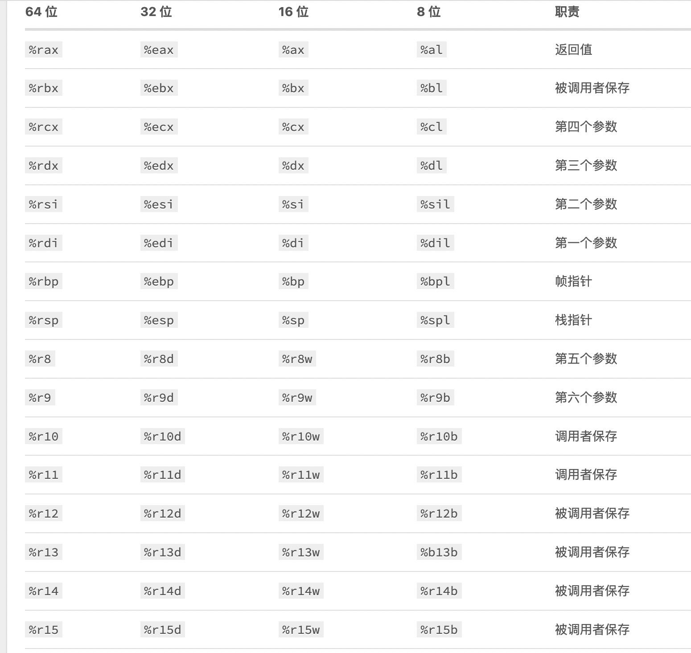
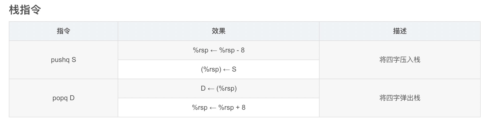

# coroutine
>C语言本身没有协程，经过调研，结合腾讯libco和风云博主的libcoroutine，开发了自己的协程库，比libco轻载，比libcoroutine性能高

## 协程简介
>协程：轻量级线程。又称微线程，纤程。
>马尔文·康威于1958年发明了术语“coroutine”并用于构建汇编程序，关于协程的最初于1963年发表了论文

## 为什么要协程：
>1，摩尔定律破产：硬件更新速度下降       
>2，C10X问题：C10K，C10M 问题（单机并发连接）         
>3，网络问题：阻塞，非阻塞，异步，io多路复用等        
>4，进程-》线程-》协程      

## 我为什么要做这个轻量级协程库
>1，对网络应用作极致的优化，其中对需要线程进行优化     
>2，C语言没有协程的概念     

## C语言协程库对比：myCo VS libco VS libcoroutine

来源|名称|切换开销(ns)|内存开销|简介
---------|---------|----------|---------|---------
腾讯|libco |280|128KB|高效协程切换+独享协程栈空间
风云博主|libcoroutine |1 200|共享主栈空间，每个小协程有保存上下文的空间|低效协程切换+共享栈空间
liujun|myCo|360|共享主栈空间，每个小协程有保存上下文的空间|高效协程切换+共享栈空间


## 寄存器 

### CPU架构
>1，MIPS    
>2，PowerPC   
>3，x86/x64   
>4，IA64   
>5，ARM   
>6，······   

>市场应用最为广泛的x86-x64架构

### 寄存器作用简介

>1，通用寄存器      
>2，标志寄存器     
>3，指令寄存器     
>4，段寄存器    
>5，控制寄存器    
>6，调试寄存器   
>7，描述符寄存器   
>8，任务寄存器   
>9，MSR寄存器    





## 汇编简介
>1,leaq指令：lea指令是mov指令的变种，据说，lea指令是x86体系结构中，是一条最古老但是从某个方面来讲又是最神奇的指令。它做的事情非常简单，根据括号里的源操作数来计算地址，然后把地址加载到目标寄存器中

>2，pushq & popq指令：



## 高效协程切汇编介绍

```

.globl coctx_swap
#if !defined( __APPLE__ )
.type  coctx_swap, @function
#endif
coctx_swap:

#if defined(__i386__)
	leal 4(%esp), %eax //sp 
	movl 4(%esp), %esp 
	leal 32(%esp), %esp //parm a : &regs[7] + sizeof(void*)

	pushl %eax //esp ->parm a 

	pushl %ebp
	pushl %esi
	pushl %edi
	pushl %edx
	pushl %ecx
	pushl %ebx
	pushl -4(%eax)

	
	movl 4(%eax), %esp //parm b -> &regs[0]

	popl %eax  //ret func addr
	popl %ebx  
	popl %ecx
	popl %edx
	popl %edi
	popl %esi
	popl %ebp
	popl %esp
	pushl %eax //set ret func addr

	xorl %eax, %eax
	ret

#elif defined(__x86_64__)
	leaq 8(%rsp),%rax //计算地址%rsp+8，然后把最终地址载到寄存器rax中
	leaq 112(%rdi),%rsp //将第一个参数地址+112，存入rsp，112=14*8，14个寄存器地址，存的是当前协程的栈顶地址
	pushq %rax        //此时rax中存的当前协程的rsp，把这个数据存入当前协程对象中的reg数组中rsp中，参照coctx_t，和coctx.c中的枚举定义
	pushq %rbx
	pushq %rcx
	pushq %rdx

	pushq -8(%rax) //ret func addr

	pushq %rsi
	pushq %rdi
	pushq %rbp
	pushq %r8
	pushq %r9
	pushq %r12
	pushq %r13
	pushq %r14
	pushq %r15
	
	movq %rsi, %rsp //第二个参数，即把待切入的协程存入栈寄存器
	popq %r15		//把待切入的协程对象中reg中存的对应的寄存器数据，存入对应的寄存器
	popq %r14
	popq %r13
	popq %r12
	popq %r9
	popq %r8
	popq %rbp
	popq %rdi
	popq %rsi
	popq %rax //ret func addr
	popq %rdx
	popq %rcx
	popq %rbx
	popq %rsp
	pushq %rax
	
	xorl %eax, %eax
	ret
#endif

```


